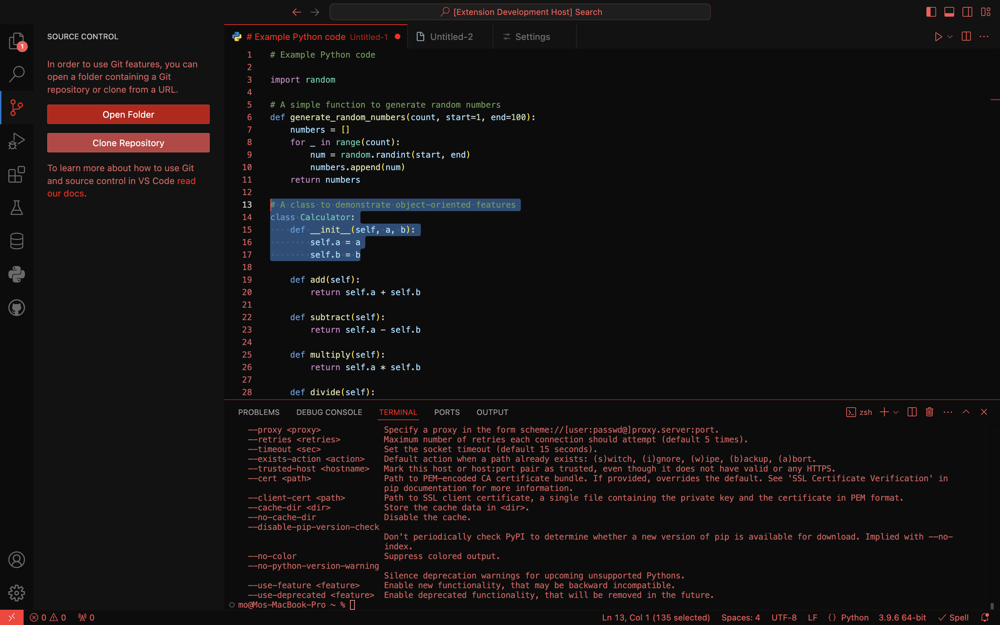
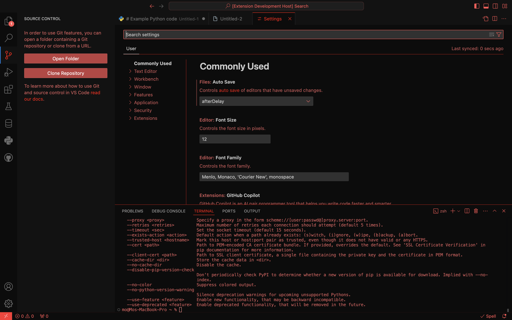
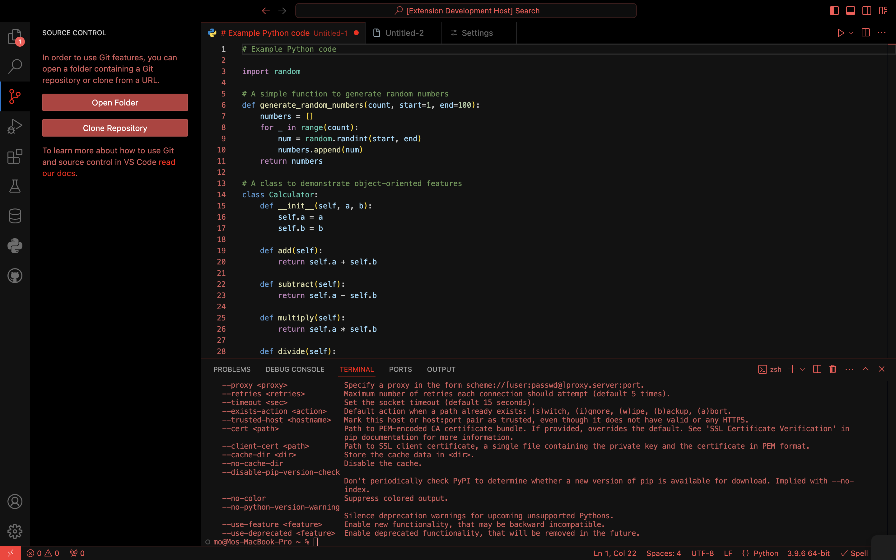
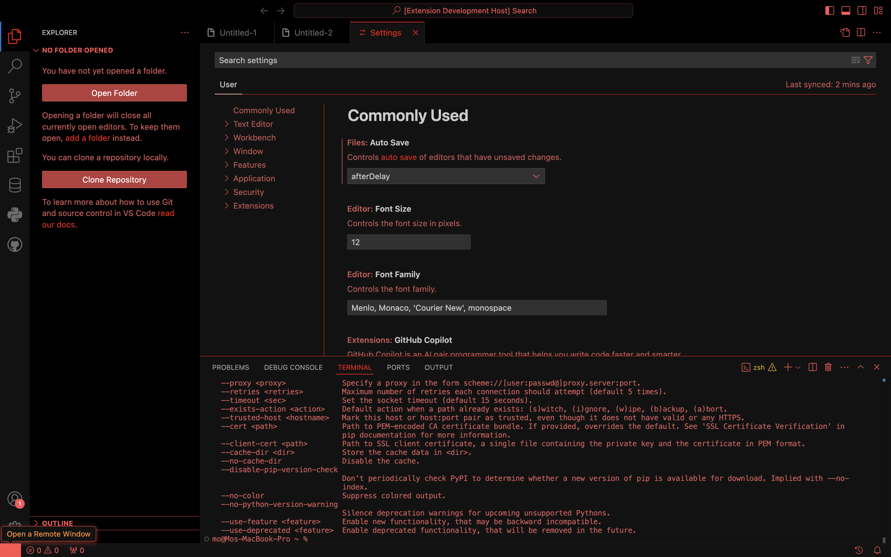

# Summary 
A custom modern dark red theme for VSCode. Synthwave inspired design thats built off of the default VSCode modern dark theme in order to not sacrifice syntax color tokens.

Since different monitors produce different colors I made 2 different versions. You can view the images below and see which version looks best on your screen. Personally 0.0.2 looks better on my mac, and 0.0.3 looks better on my PC Samsung monitor

# Preview 0.0.3 (Latest)





# Preview 0.0.2 (Better On Mac)





# Installation

If you want this them for yourself you can either download the latest build and install it manually in VSCode or fork this repo and compile it using the vsce package

```
npm install -g vsce
```

Navigate to your theme directory in the terminal and run:
```
vsce package
```
then install the extension manually in VSCode